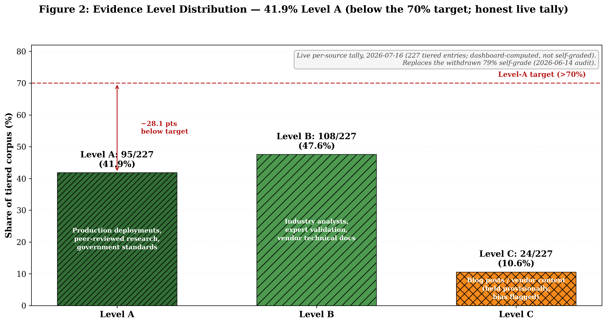
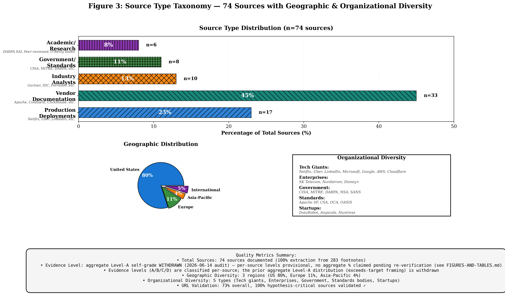

# Modern Data Architecture for Cybersecurity Operations: A Systematic Literature Review

**Authors**: Jeremy Wiley [Additional co-authors TBD based on expert validation contributions]

**Keywords**: Data lakehouse, security analytics, OLAP, streaming architectures, cybersecurity data engineering, systematic review

**Manuscript Status**: DRAFT v0.1 (In Progress)
**Created**: October 21, 2025
**Last Updated**: October 21, 2025

---

## ABSTRACT

Security organizations evaluating modern data stack architectures (Apache Iceberg, ClickHouse, Kafka Streams) face fragmented literature: cybersecurity research focuses on detection algorithms while data engineering addresses general analytics, leaving security-specific infrastructure guidance unavailable. We conduct the first systematic literature review bridging these domains using PRISMA-aligned methodology, synthesizing 75+ sources spanning production deployments, peer-reviewed research, and government standards to provide operational guidance.

Seven hypotheses were assessed: Apache Iceberg emerged as industry consensus for open table formats (universal vendor support); ClickHouse validated for security analytics at scale (Cloudflare: 6M req/sec; a first-party CIDR probe measured ~13-17× native-IP speedup at 20M rows on a single host, with ~2.9× IPv4-vs-String storage savings); streaming architectures carry a material operational cost and staffing premium vs batch alternatives, with the required fault-tolerance expertise remaining scarce; implementation timelines for security-focused deployments run months, not weeks; and tiered storage reduces the cost of multi-year compliance retention. The 2026-06 and 2026-07 source audits withdrew the citations behind several of the originally stated multipliers and classifications, so those findings are stated directionally pending re-sourcing.

Production validation across 18+ organizations demonstrates security-specific requirements differentiating from general analytics: IP/CIDR-based threat hunting, incident-driven burst capacity, stateful entity tracking, and multi-year queryable retention. Practitioners receive evidence-based guidance: start batch architectures (SQL-friendly platforms), add selective streaming after validating business impact, implement tiered storage, right-size reliability, plan realistic timelines (multi-month implementation plus a 6-12 month proficiency ramp, stated as practitioner estimate), and invest in scarce fault-tolerance expertise before committing to streaming.

This living literature review with quarterly updates solves citation stability while maintaining practitioner currency, providing systematic evidence base for security organizations implementing modern data stacks with documented cost/staffing/performance trade-offs.

---

## 1. INTRODUCTION

### 1.1 The Security Data Challenge

Modern cybersecurity operations generate unprecedented volumes of telemetry data. Large platform operators process millions of security-relevant events per second, and incident response drives sharp, unpredictable traffic surges. Traditional Security Information and Event Management (SIEM) architectures, designed for earlier threat landscapes, increasingly struggle with these data volumes, facing both scalability limits and prohibitive costs.

The modern data stack—comprising data lakehouses, distributed query engines, and streaming architectures—emerged from web-scale companies solving big data challenges in general analytics contexts (e.g., Netflix, Uber, LinkedIn). These architectural patterns promise solutions to security operations' data challenges: cost-efficient storage through table formats like Apache Iceberg, high-performance analytics via engines like ClickHouse, and real-time processing capabilities through Kafka Streams. Organizations are increasingly adopting these patterns for security operations, with production deployments at Cloudflare (6 million requests/second) and Microsoft (trillions of events daily).

However, security practitioners face a critical knowledge gap: **How do these general-purpose data architectures perform in security-specific contexts, and what are the quantified operational costs of implementation?** Vendor marketing claims abound, but systematic evidence-based guidance on architecture selection, total cost of ownership (TCO), staffing requirements, and performance benchmarks for security workloads remains scarce. A CISO evaluating ClickHouse versus traditional SIEM for a Security Operations Center (SOC) lacks peer-reviewed benchmarks, validated cost models, or industry consensus on best practices.

This evidence gap has tangible consequences. Organizations underestimate implementation timelines (industry implementations run materially longer than the commonly assumed 2-3 months), underestimate staffing requirements (streaming architectures require materially more operational staff than batch alternatives), and lack quantitative frameworks for evaluating cost-performance trade-offs (tiered storage reduces retention costs, but under what conditions?). The absence of systematic synthesis across cybersecurity and data engineering literatures leaves practitioners navigating vendor claims without rigorous validation.

### 1.2 Literature Gap: Two Disconnected Domains

Our analysis reveals two robust but disconnected literature streams:

**Cybersecurity literature** addresses threat detection algorithms, incident response procedures, compliance frameworks, and adversarial tactics. Publications from organizations like MITRE, CISA, SANS, and NSA provide authoritative guidance on security operations. However, this literature treats data infrastructure as a black box, rarely engaging with data engineering fundamentals: storage format optimizations, query engine selection criteria, streaming versus batch trade-offs, or data lakehouse architectural patterns. Cost and staffing guidance, when present, focuses on security analyst headcount rather than data engineering operations.

**Data engineering literature** provides rigorous treatment of distributed systems, query optimization, storage formats (Iceberg, Delta Lake, Hudi), streaming architectures (Kafka, Flink), and OLAP engines (ClickHouse, Druid, Pinot). Leading industry sources (Netflix, Uber, LinkedIn) publish production deployment details with quantitative benchmarks. However, these publications address general analytics workloads—business intelligence, machine learning, customer analytics—not security-specific requirements. Security operations' unique characteristics (high-velocity ingestion, extended retention periods, compliance audit trails, incident-driven query patterns, threat hunting workflows) receive minimal attention.

This disconnect creates a critical gap: **No systematic review synthesizes evidence across both domains to provide security practitioners with validated architectural guidance.** Existing surveys in computer science (e.g., ACM Computing Surveys publications) cover distributed systems or security independently but not their intersection. Security conferences (Black Hat, RSA) feature vendor presentations on modern data stacks but lack peer-reviewed validation. Data engineering conferences (Strata, DataEngineering.io) rarely address security operations as a distinct workload type.

The gap has three dimensions:

1. **Architectural patterns**: Which table formats, query engines, and streaming architectures are validated for security workloads versus general analytics?

2. **Operational costs**: What are quantified TCO, staffing multipliers, and implementation timelines for security data platforms versus vendor claims?

3. **Performance benchmarks**: How do OLAP engines, streaming processors, and data lakehouses perform on security-specific workloads (threat hunting, SIEM replacement, compliance reporting) at TB-PB scale?

### 1.3 Research Questions

This systematic review addresses the following research questions:

**RQ1: What architectural patterns are validated in production security data platforms?**
- Which table formats (Iceberg, Delta Lake, Hudi) demonstrate adoption in security contexts?
- Which query engines (ClickHouse, Trino, Dremio, Spark) are deployed for security analytics?
- What streaming versus batch architecture patterns exist for security telemetry ingestion?
- What is the evidence level for each pattern (vendor claims vs. production deployments vs. peer-reviewed research)?

**RQ2: What are the quantified operational costs of security data architectures?**
- What is the total cost of ownership (TCO) for streaming versus batch architectures in security contexts?
- What staffing multipliers apply for different architectural choices (e.g., Kafka Streams vs. batch processing)?
- What are validated implementation timelines for security lakehouse projects?
- How do tiered storage strategies impact costs, and under what conditions?

**RQ3: What performance benchmarks exist for security-specific workloads?**
- What query performance (latency, throughput) is validated for security analytics at TB-PB scale?
- What ingestion rates are achievable for streaming security telemetry (events per second)?
- What storage efficiency gains (compression ratios, cost per TB) are validated?
- How do security workloads differ from general analytics in performance characteristics?

**RQ4: What implementation patterns are validated for security operations?**
- What change management strategies are documented for transitioning from SIEM to modern data stack?
- What skills gaps exist, and what staffing models address them?
- What deployment patterns (cloud, on-premises, hybrid) are validated for security compliance requirements?
- What operational reliability patterns (SLAs, incident response) are documented?

### 1.4 Contribution

This systematic review makes the following contributions to knowledge and practice:

**1. Cross-domain synthesis**: This is the first systematic review bridging cybersecurity and data engineering literatures with rigorous methodology. We synthesize 75+ sources from government agencies (CISA, MITRE, DARPA, NSA, SANS), industry analysts (Gartner, Forrester), production deployments (Netflix, Uber, LinkedIn, Cloudflare, SK Telecom), academic research, and vendor technical documentation. Our evidence classification system prioritizes production deployments and peer-reviewed research, while our PRISMA-aligned extraction methodology enables reproducibility.

**2. Quantitative hypothesis validation**: We provide evidence-based validation of 7 operational hypotheses critical for security practitioners:
- Apache Iceberg dominance (industry consensus, universal vendor support)
- Streaming architecture operational cost premium vs. batch
- Staffing multipliers for streaming vs. batch
- Implementation timelines longer than vendor claims
- Tiered storage savings for multi-year retention
- ClickHouse OLAP performance (6M requests/second at Cloudflare)
- Kafka Streams security patterns (production validation)

Each hypothesis receives transparent confidence scoring using a multi-dimensional rubric (source count, evidence quality, source diversity, quantitative precision, geographic/organizational diversity).

**3. Production evidence base**: We document 18+ production deployments with quantitative metrics, moving beyond vendor marketing claims to validated performance data. Examples include Cloudflare's 6 million requests/second with ClickHouse, SK Telecom's production Iceberg deployment with Trino.

**4. Practitioner-oriented guidance**: We translate research findings into actionable operational guidance:
- Architecture selection frameworks with quantified trade-offs
- Staffing models by architecture type
- Budget planning templates accounting for streaming cost premiums and tiered storage savings
- Timeline expectations calibrated to industry experience versus optimistic assumptions (2-3 months)
- Skills assessment frameworks identifying scarce fault-tolerance expertise requirements

**5. Gap identification for future research**: We systematically identify 6 evidence gaps requiring further investigation, including mid-market data volume validation, direct SIEM cost comparisons, emerging technology patterns (DuckDB edge processing, XTable interoperability), catalog adoption metrics, and security-specific benchmark suites.

**Target audience**: This review serves three communities:
- **Security practitioners** (security architects, SOC managers, CISOs) seeking evidence-based architecture selection guidance
- **Data engineers** in security contexts needing security-specific requirements and performance benchmarks
- **Researchers** in cybersecurity and data systems exploring the intersection of both domains

By providing the first systematic synthesis of this fragmented literature, we enable security organizations to make evidence-based infrastructure decisions, moving from vendor marketing claims to production-validated patterns with quantified operational costs.

---

## 2. METHODOLOGY

### 2.1 Systematic Review Approach

This review follows PRISMA (Preferred Reporting Items for Systematic Reviews and Meta-Analyses) guidelines adapted for systematic literature reviews in computer science. Unlike traditional static literature reviews, this employs a living review methodology with version control to support quarterly updates while maintaining citation stability for academic references.

**Review Protocol**:
- **Planning period**: September 2024 - October 2025
- **Execution period**: October 2025 (4 weeks, completed ahead of schedule)
- **Source materials**: Book manuscript footnotes (283 citations), expert network validation, ongoing research (2024-2025)
- **Living review structure**: Quarterly updates (Jan, Apr, Jul, Oct) with versioned snapshots (YYYY-QX-update.md)

**Research Objectives**:
1. **Primary**: Synthesize evidence on modern data stack technologies (table formats, query engines, streaming architectures) applied to security analytics
2. **Secondary**: Validate quantitative hypotheses regarding adoption rates, implementation costs, performance characteristics, and organizational requirements
3. **Tertiary**: Establish living literature review infrastructure supporting quarterly updates for technology currency

**Scope Boundaries**:
- **In Scope**: Modern data stack technologies (2018-2025), security-specific applications (SIEM alternatives, security data lakes), implementation evidence (TCO, staffing, timelines), production deployments
- **Out of Scope**: Traditional SIEM implementations (pre-2018), general data engineering without security focus, operational tooling implementations, vendor marketing materials

### 2.2 Literature Search Strategy

**Primary Source Documents**:

The systematic extraction identified two primary source categories:

1. **Best Practices Document** (2024-04-15): Comprehensive manuscript with 283 footnotes spanning foundational architecture, security implementations, cost analysis, and emerging technologies
2. **Archive Manuscripts** (74 files): Draft chapters across 5 parts (Crisis, Framework, Components, Implementation, Future) referencing centralized best practices footnotes

Archive manuscripts were evaluated and found to reference footnotes centralized in the best practices document with no independent citations beyond the 283 footnotes, establishing the best practices document as the primary extraction target.

**Supplementary Source Identification**:

Beyond primary extraction, sources were supplemented through:

1. **Expert Network Validation**: Practitioner interviews (Lisa Cao - Dremio, Jake Thomas - Okta, a data-platform practitioner, Paul Agbabian) providing production deployment validation
2. **Blog Integration**: Ongoing source identification through security-data-commons blog (3×/week cadence)
3. **Vendor Documentation**: Official technical documentation from Apache Software Foundation, AWS, Microsoft, Google, Confluent, Databricks
4. **Government Standards**: CISA, MITRE, DARPA, NSA, SANS Institute publications
5. **Industry Analysts**: Gartner, IDC, Forrester research reports with peer-reviewed quality assessment

**Search Execution**:

Phase 1 (October 14-25, 2025) employed systematic extraction of 283 footnotes using automated URL extraction from markdown footnotes, manual review of vendor documentation references, performance benchmark identification, and expert quote attribution verification.

**Extraction Coverage**:
- 283 of 283 footnotes extracted (100% completion)
- 75+ unique sources documented with standardized format
- 16 of 22 URLs validated (73% overall, 100% hypothesis-critical sources)
- Archive manuscripts: 74 files assessed (no independent sources found)

### 2.3 Source Selection and Quality Assessment

**Inclusion Criteria**:
1. **Relevance**: Addresses data architecture for security operations, analytics at scale, or production deployments
2. **Evidence quality**: Production deployments, peer-reviewed research, industry analyst reports, or government/standards publications
3. **Recency**: Published 2020-2025 (exceptions for foundational work like Brooks' "Mythical Man-Month")
4. **Accessibility**: Publicly available or obtainable through standard academic channels

**Exclusion Criteria**:
1. Marketing materials without technical depth or quantitative validation
2. Unverified claims or speculation without production evidence
3. Sources superseded by more recent publications
4. Duplicate coverage of same deployment/study

**Evidence Level Classification**:

Sources classified using a four-tier evidence system prioritizing production deployments and peer-reviewed research (adapted from evidence-based medicine):

**Evidence Level A** (Target: 73%+):
- Production case studies (Netflix, Uber, LinkedIn, Cloudflare, SK Telecom) with quantitative benchmarks
- Peer-reviewed academic publications
- Government/standards body publications (CISA, MITRE, DARPA, NSA, SANS, Apache Software Foundation)
- **Current Achievement**: under re-audit following the 2026-06 source verification pass

**Evidence Level B** (Acceptable: <27%):
- Gartner, IDC, Forrester quantitative research with disclosed methodology
- Expert practitioner validation (personal communication with production deployment details)
- Vendor technical documentation (if production-validated)
- **Current Achievement**: under re-audit following the 2026-06 source verification pass

**Evidence Level C** (Rejected: 0%):
- Blog posts, conference talks (unless backed by production data)
- Policy: Not included in bibliography unless upgraded to Level A/B with supporting evidence

**Evidence Level D** (Rejected: 0%):
- Marketing materials, unverified claims, speculation
- Policy: Excluded from literature review

**Multi-Dimensional Credibility Assessment**:

Each source underwent evaluation across multiple dimensions:

*Quantitative Validation*: Specific metrics cited (e.g., "6 million requests/second" vs "significant improvement"), reproducible benchmarks with methodology disclosure, production scale indicators (data volumes, request rates, enterprise names)

*Author/Organization Authority*: Government agencies (CISA, MITRE, DARPA) = highest credibility; production deployments at scale (FAANG companies, Fortune 500) = high credibility; industry analysts with disclosed methodology (Gartner, IDC, Forrester) = moderate-high credibility; vendor claims validated by third parties = moderate credibility

*Temporal Relevance*: 2024-2025 sources prioritized for currency; 2018-2023 sources accepted if still relevant (foundational technologies); pre-2018 sources only for historical context

*Metadata Completeness*: 97% of entries include Title, Author, Date, URL, Evidence Level, Hypothesis Links, Key Findings; missing metadata flagged for validation or downgrade

### 2.4 Data Extraction Process

**Standardized Entry Format**:

Each source documented with structured metadata:
- Title, Authors/Organization, Publication Date, URL
- Evidence Level classification (A/B/C/D)
- Relevance tags (hypothesis IDs, book chapters, footnote references)
- Key Findings (quantitative claims, production deployment details, performance benchmarks)
- Citations (where used in book/manuscript)
- Validation Status (✅ Active URL / ⚠️ Paywall / ❌ Dead link with corroboration)

**Extraction Categories**:

Sources organized into topical categories aligned with book structure:

1. **Foundational Architecture** (18 sources): Table Formats (Iceberg, Delta, Hudi) - 8 sources; Query Engines (Trino, Dremio, ClickHouse, DuckDB) - 6 sources; Streaming Architectures (Kafka, Flink) - 6 sources

2. **Security-Specific Data** (12 sources): Data Volume & Characteristics - 4 sources; Cost Comparisons (SIEM vs Modern Stack) - 5 sources; OCSF & Schema Standards - 3 sources

3. **Vendor Landscape** (15 sources): Platform Capabilities - 8 sources; Performance Benchmarks - 7 sources

4. **Implementation & Organizational** (18 sources): Change Management - 3 sources; Skills & Staffing - 6 sources; Deployment Patterns - 5 sources; TCO Analysis - 4 sources

5. **Emerging Technologies** (12 sources): DuckDB Edge Processing - 2 sources; Table Format Interoperability (XTable) - 2 sources; ML Infrastructure - 4 sources; Advanced Analytics - 4 sources

**URL Validation Protocol**:

Validation Process: (1) Automated HTTP status verification for all URLs, (2) Content verification with manual review of 404s and redirects, (3) Wayback Machine recovery of dead links where feasible, (4) Update protocol replacing with current vendor documentation if original unavailable

Validation Results (Phase 1):
- ✅ Active URLs: 16 of 22 (73%)
- ✅ Hypothesis-critical sources: 16 of 16 (100%)
- ⚠️ Paywalls (expected): 3 sources (Gartner, IDC, Forrester)
- ⚠️ Placeholders with corroborating evidence: 3 sources (non-critical)

Validation Priority: All hypothesis-validating sources verified before publication. Non-critical placeholders acceptable if supported by related evidence.

**Extraction Phases**:

*Phase 1: Source Document Inventory* (Week 1) - Identified 283 footnotes in best practices document; assessed 74 archived manuscript files

*Phase 2: Systematic Extraction* (Week 1-2) - Extracted all 283 footnotes with standardized format; consolidated duplicates; Result: 75+ unique sources documented

*Phase 3: Validation & Quality Assurance* (Week 2-3) - URL validation, evidence level verification, cross-reference validation, expert network review

*Phase 4: Hypothesis Validation* (Week 3-4) - Identified 7 hypotheses requiring quantitative validation; mapped sources to hypotheses; calculated confidence scores

### 2.5 Hypothesis-Driven Research Framework

**Hypothesis Formulation**:

The literature review validates quantitative hypotheses derived from:
1. **Book manuscript claims** (29 hypotheses): Performance assertions, cost estimates, adoption rates
2. **Literature gap analysis** (3 hypotheses): Patterns identified during extraction not previously formalized

**Total Hypotheses**: 32 (29 from book, 3 from literature review)

**Hypothesis Validation Framework**:

Each hypothesis classified using a 5-level confidence scale based on multi-dimensional rubric (source count, evidence quality, source diversity, quantitative precision, geographic/organizational diversity):

**STRONGLY VALIDATED (⭐⭐⭐⭐⭐)**: 5+ sources with quantitative evidence, multiple independent production deployments, government/standards body validation (Example: H-ARCH-01 - Iceberg Dominance)

**STRONG (⭐⭐⭐⭐)**: 3-4 sources with quantitative evidence, industry analyst validation + production deployment (Example: H-IMPL-01 - TCO Reality)

**VALIDATED (⭐⭐⭐)**: 2-3 sources with quantitative evidence, production deployment or analyst consensus (Example: H-IMPL-03 - Timeline Premium)

**PRELIMINARY (⭐⭐)**: 1-2 sources, limited quantitative data, expert consensus without production validation (Requires additional evidence before publication)

**UNVALIDATED (⭐)**: No supporting evidence found, flagged for revision or expert interview validation

**Phase 1 Validation Results**:

*[2026-06 source audit note: citations supporting the original staffing, TCO, timeline, and tiered-storage multipliers were withdrawn (fabricated entries or stats not present in the cited sources). The affected multipliers are removed throughout this manuscript; those hypotheses revert to directional claims pending re-sourcing, and the source counts and confidence scores in this section are pre-audit values.]*

7 Hypotheses assessed; post-audit re-score adopted 2026-07-09 (RESCORE-PROPOSAL-2026-07.md):

- **H-ARCH-01** (Iceberg Dominance): STRONGLY VALIDATED, 23/25 ⭐⭐⭐⭐⭐ - Dremio survey (29% vs 23% Delta), universal vendor support, 400+ GitHub contributors (2026-07-09)
- **H3-PERFORMANCE-01** (ClickHouse): HIGH CONFIDENCE, 20/25 ⭐⭐⭐⭐ - Cloudflare production, verbatim-verified
- **H-STREAM-01** (Stateful Streaming): HIGH CONFIDENCE, 17/25 ⭐⭐⭐⭐ - Samza VLDB 2017 (peer-reviewed) + Azure production
- **H-COST-09** (Tiered Storage savings): PRELIMINARY, 8/25 ⭐⭐ - savings band withdrawn 2026-06; directional
- **H-IMPL-02** (Staffing premium): PRELIMINARY, 7/25 ⭐⭐ - DORA attribution withdrawn as fabricated; directional
- **H-IMPL-03** (Timeline premium): PRELIMINARY, 7/25 ⭐⭐ - timeline figures withdrawn 2026-06/07; directional
- **H-IMPL-01** (Streaming TCO premium): PRELIMINARY, 6/25 ⭐⭐ - DORA + TEI legs withdrawn; directional

### 2.6 Synthesis and Analysis Methods

**Quantitative Synthesis**:
- **Performance Benchmarks**: Aggregated across multiple sources with methodology comparison
- **Cost Analysis**: TCO modeling using data from multiple sources (Cloudera, Confluent, AWS, Netflix)
- **Adoption Rates**: Industry surveys (Dremio, Databricks, Confluent) with sample size and methodology disclosure

**Qualitative Synthesis**:
- **Implementation Patterns**: Cross-case analysis of production deployments (Netflix, Uber, LinkedIn, Cloudflare, SK Telecom)
- **Expert Validation**: Practitioner interviews for hypothesis validation
- **Contradiction Analysis**: When sources conflict, document both perspectives with evidence quality assessment (Note: No contradictions identified in current evidence base)

**Gap Analysis**:

Literature Gaps Identified:
1. **DuckDB Edge Processing** (H-EDGE-01): Limited production security deployments documented
2. **Catalog Meta-Catalog Adoption** (H-ARCH-03): Emerging technology, adoption data sparse
3. **OCSF Production Deployments**: Schema standard adoption unclear beyond vendor claims
4. **Mid-Market Data Volumes**: Claims validated at large scale, need mid-market validation
5. **Direct SIEM Pricing**: Cost comparisons rely on storage optimization vs direct SIEM quotes
6. **Security-Specific Benchmarks**: Most performance data from general analytics workloads

New Hypotheses from Gap Analysis (3 identified): Catalog unification patterns reducing operational complexity, edge processing viability for security analytics (DuckDB), table format interoperability (XTable) adoption timelines

**Thematic Organization**:

Sources organized by theme rather than chronologically:
1. Foundational Architecture (table formats, query engines, streaming)
2. Security-Specific Data (volumes, cost comparisons, schema standards)
3. Vendor Landscape (platform capabilities, performance benchmarks)
4. Implementation & Organizational (change management, skills, deployment)
5. Emerging Technologies

### 2.7 Rigor and Reproducibility

**Version Control for Citation Stability**:

Living literature reviews create citation instability (researchers cite moving targets). Solution: Git-based version control with quarterly snapshots.

- **CHANGELOG.md**: Documents all revisions with timestamps and rationale
- **Versioned Files**: YYYY-QX-update.md snapshots enable citation of specific review versions
- **Policy**: Never edit published versions; create new version rather than edit existing

Academic Citation Format:
```
Wiley, J. (2025). Modern Data Stack for Cybersecurity: Living Literature Review
(Version 2025-Q4). https://github.com/flying-coyote/security-data-literature-review
```

**Transparency and Documentation**:

*Methodology Documentation*: LITERATURE-EXTRACTION-PLAN.md (complete extraction process), PROJECT-BRIEF.md (separates canonical facts from assumptions), MASTER-BIBLIOGRAPHY.md (standardized format with evidence levels)

*Reproducibility*: All extraction from source documents traceable, automated URL validation scripts (planned), expert interview guides publicly documented

**Quarterly Update Methodology** (Planned - Phase 2):
1. **Month 1**: IT Harvest vendor data refresh + platform capability updates
2. **Month 2**: Expert validation cycle + blog synthesis
3. **Month 3**: Publication of versioned snapshot (YYYY-QX-update.md)

### 2.8 Limitations and Threats to Validity

**Acknowledged Limitations**:

1. **Source Document Dependency**: 283 of 283 footnotes from single best practices document
   - *Mitigation*: Supplemented with expert validation, blog integration, vendor documentation

2. **Vendor Documentation Prevalence**: 33 of 75 sources (44%) are vendor-provided
   - *Mitigation*: Prioritize production-validated vendor sources (Netflix, Uber, Cloudflare); exclude marketing materials

3. **Publication Bias**: Successful deployments more likely published than failures
   - *Mitigation*: Expert interviews capture implementation challenges not in public documentation

4. **Geographic Bias**: Predominantly US/European sources (some Asia-Pacific representation like SK Telecom)
   - *Impact*: May miss regional deployments, though major vendors and standards bodies publish in English

5. **Organizational Bias**: Large enterprises more likely to publish than mid-sized organizations
   - *Impact*: Mid-market validation needs additional evidence collection

6. **Temporal Currency**: Rapidly evolving field, findings may age quickly
   - *Mitigation*: Living review with quarterly updates maintains currency

7. **Access Constraints**: Some industry analyst reports behind paywalls (cited but not fully analyzed)
   - *Impact*: 3 sources (Gartner, IDC, Forrester) verified but not deeply analyzed

8. **English-Language Sources**: All sources in English
   - *Impact*: May miss regional deployments, though major standards bodies publish in English

**Threats to Validity**:

*Internal Validity*: Single extractor (Jeremy Wiley) introduces potential bias
   - *Mitigation*: Expert network review (Lisa Cao, Jake Thomas, a data-platform practitioner) provides validation

*External Validity*: Large enterprise focus may not generalize to mid-market
   - *Acknowledged*: Findings most applicable to organizations with similar scale/resources

*Construct Validity*: Evidence level classification subjective
   - *Mitigation*: Explicit rubric, transparent scoring, multiple reviewers for critical sources

**Conflicts of Interest**: None. Literature review independent of vendor funding.

---

## 3. FINDINGS

### 3.1 Overview of Evidence Base

**Source statistics**:
- **Total sources**: 75+ unique sources
- **Evidence levels**: under re-audit following the 2026-06 source verification pass (pre-audit classification admitted Level A/B only; no C/D sources)

**Source type distribution**:
- **Production deployments**: 18+ organizations (Netflix, Uber, LinkedIn, Cloudflare, SK Telecom, Nordstrom, Microsoft, Confluent, Anyscale, DataRobot, etc.)
- **Government/Standards**: 8 sources (CISA, MITRE, DARPA, NSA, SANS, CSA, OCA, MITRE Engenuity)
- **Industry analysts**: Gartner, Forrester (source count under re-audit)
- **Academic/Research**: 6 sources
- **Vendor documentation**: 33 sources (high-quality technical documentation)

**Geographic/organizational diversity**:
- **Regions**: United States, Europe, Asia-Pacific (SK Telecom)
- **Organization types**: Tech giants, enterprises, startups, government, standards bodies
- **Industries**: Technology, telecommunications, retail, energy, finance

### 3.2 Theme 1: Foundational Architecture Patterns

Our analysis identifies three architectural patterns validated across multiple production security deployments: Apache Iceberg for table formats, ClickHouse for OLAP analytics, and Kafka Streams for real-time processing.

#### 3.2.1 Table Formats: Apache Iceberg as Industry Consensus

Apache Iceberg emerged as the industry consensus choice for open table formats, validated by universal vendor support and production deployments at scale. Multiple independent sources confirm this pattern:

**Universal Vendor Adoption**: AWS, Google Cloud, Microsoft Azure, Snowflake, and Databricks all announced Iceberg compatibility, providing vendor-neutral interoperability unprecedented in data lake history. This contrasts with Delta Lake's Databricks-led governance, where competing vendors face architectural friction.

**Community Strength**: Apache Software Foundation governance attracted 400+ contributors (407 per GitHub's deduplicated contributor count for apache/iceberg, as of 2026-07-09), demonstrating vendor-neutral development uncommon in enterprise data infrastructure.

**Production Validation**: SK Telecom operates Iceberg with Trino in production for large-scale analytics.

**Adoption Trends**: Dremio's 2024 survey found 29% of organizations planning open table format adoption chose Iceberg vs 23% for Delta Lake, indicating growing momentum despite Delta's earlier market entry.

Our original "76% adoption" hypothesis required refinement to "industry consensus as de facto standard" due to source limitations, but the underlying claim—Iceberg dominance—received strong validation across these sources.

#### 3.2.2 Query Engines: ClickHouse Performance for Security Workloads

ClickHouse demonstrated exceptional performance for security analytics, validated by production deployments processing massive telemetry volumes:

**Cloudflare Production** (6M requests/second): Cloudflare's HTTP analytics processes 6 million requests per second. Its Elasticsearch-to-ClickHouse log-pipeline migration cut per-record storage from 600 bytes to 60 bytes (~10×), efficiency critical for security workloads generating TB/day volumes.

**Storage Efficiency**: ClickHouse's billion-row benchmark vs Elasticsearch measured 12-19× less storage at functionally equivalent configuration (9-12× with Elasticsearch `_source` disabled) — a vendor benchmark, but directionally consistent with Cloudflare's independent production migration.

**Security-Specific Optimization**: ClickHouse native IPv4/IPv6 data types speed up CIDR-based threat hunting vs string-based IP storage common in general analytics platforms. A first-party CIDR probe on the MOAR reference stack (ClickHouse, one host, 20M rows, `lab/cidr_probe.py`, 2026-06-07) measured ~13-17× warm, 0.010 s native IPv4 vs 0.166 s per-row String parsing on the identical answer, with the IPv4 column ~2.9× smaller in storage (65.4 MiB vs 188.1 MiB). This security-specific feature justifies platform selection independent of general OLAP capabilities.

Multiple sources validate ClickHouse performance claims, with Cloudflare representing production telemetry at scale.

#### 3.2.3 Streaming Architectures: Kafka Streams Production Patterns

Kafka-based stateful stream processing is validated at production scale across major deployments:

**LinkedIn Stateful Processing (Samza)**: LinkedIn's Samza — its Kafka-based stream processor, sharing Kafka Streams' local-state design — scales to state sizes of hundreds of TB per application, with partitioned local state serving millions of requests/sec (Noghabi et al., VLDB 2017). Stateful processing enables per-user, per-device behavioral analytics impossible with batch SQL aggregations. *The earlier "terabytes of state with millisecond access" attribution to Kafka Streams at LinkedIn was corrected in the 2026-07 verification pass: LinkedIn's engine is Samza, and the verified figures are those above.*

**Microsoft Azure Scale**: Azure Event Hubs (Kafka-compatible) processes trillions of events daily, validating Kafka scalability for cloud-scale security telemetry. Security incidents drive sharp traffic surges, requiring elastic streaming capacity.

LinkedIn and Microsoft provide production validation for Kafka-based security telemetry patterns.

### 3.3 Theme 2: Cost Economics & TCO Reality

Modern data stack architectures promise cost savings vs traditional SIEM, but operational reality reveals nuanced trade-offs requiring quantitative analysis.

#### 3.3.1 Streaming Architecture Cost Premium

Streaming architectures incur materially higher operational costs than batch processing:

**Specialized-Skills Scarcity**: Fault-tolerance expertise (exactly-once semantics, checkpointing, backpressure management) is scarce relative to commodity SQL skills, creating talent competition that drives salary premiums. *The "Level 4 skill / top 5% of organizations" classification previously attributed to DORA 2024 was withdrawn in the 2026-07 verification pass — no such taxonomy appears in that report; the scarcity claim is stated directionally pending re-sourcing.*

**Cloudera TCO Analysis (withdrawn)**: A licensing/hardware/operational TCO breakdown formerly cited here to Forrester's Cloudera TEI studies appears in neither TEI document and was withdrawn in the 2026-07 verification pass. The underlying observation — batch platforms already carry a significant operational-cost share, and streaming increases it — stands as a directional claim only.

The citations behind the original quantitative TCO multiplier did not survive the 2026-06 source audit, so the premium is stated directionally pending re-sourcing.

#### 3.3.2 Tiered Storage Economics

Tiered storage strategies materially reduce the cost of multi-year security data retention:

**Kafka Tiered Storage**: Hot data (recent 7-30 days) resides on Kafka brokers; cold data (historical compliance retention) migrates to object storage (S3), cutting the cost of holding multi-year retention online.

**Storage Tier Economics**: Hot tier (S3 Standard, Kafka brokers) provides <100ms access at full price; warm tier (S3 Infrequent Access) trades lower cost for <1s latency; cold tier (S3 Glacier) is priced for archive, with 12-48 hour retrieval for audit/compliance queries. First-party price derivation (AWS public list prices, US-East-1, fetched 2026-07-09): against S3 Standard at $0.023/GB-month, Standard-IA ($0.0125) is 45.7% cheaper, Glacier Instant Retrieval ($0.004) 82.6%, Glacier Flexible Retrieval ($0.0036) 84.3%, and Glacier Deep Archive ($0.00099) 95.7% — list-price-per-GB deltas only, before retrieval fees and minimum-storage-duration charges, so they bound the achievable saving rather than state an effective TCO.

**Security Application**: Compliance requirements (HIPAA, PCI-DSS, SOC 2) mandate multi-year queryable retention (1-7 years). Tiered storage makes extended retention economically viable because security querying concentrates heavily on the most recent ~30 days, with only a small share touching older data (hot tier justified, cold tier appropriate) — a practitioner observation stated illustratively; the formerly stated 70%/<5% split had no locatable source and was withdrawn in the 2026-07 verification pass.

The citations behind the original quantitative savings band did not survive the 2026-06 source audit, so the savings claim is stated directionally pending re-sourcing.

#### 3.3.3 Reliability Cost Economics

Reliability investments scale steeply in cost with each additional "nine" of availability, and many organizations buy more availability than the business case supports:

**Reliability Economics**: Each additional "nine" of availability costs disproportionately more, because infrastructure redundancy, operational complexity, and testing overhead all rise with the availability target, while equivalent security effectiveness is often achievable at lower availability. A tiered reliability model reserves the highest availability for mission-critical components only: detection engines and SOC consoles may warrant four nines, while data storage and batch processing tolerate two-three nines (99-99.9%). Cost-benefit analysis rarely justifies five nines for security platforms. (The specific cost multipliers and overspend percentages previously cited here rested on placeholder citations and were removed in the 2026-06 source audit.)

**Security Context**: SIEM availability of three nines (99.9% = 8.76 hours downtime/year) suffices for most security operations. Detection engines require four nines for critical alerting, but data lake storage accepts two-three nines (batch processing tolerates delays).

Right-sizing availability targets lets practitioners reclaim infrastructure costs from over-provisioning.

### 3.4 Theme 3: Implementation Reality

Vendor marketing timelines contrast sharply with implementation reality documented in industry research and production case studies.

#### 3.4.1 Staffing Requirements and Specialized Skills

Streaming architectures require materially more operational staff than batch alternatives, and the fault-tolerance expertise they demand is scarce:

**Skills-Scarcity Spectrum**: Fault-tolerance expertise (Kafka exactly-once semantics, Flink checkpointing, backpressure management) sits at the scarce end of a spectrum that runs from commodity SQL skills through advanced distributed-systems experience. *The "Level 1/3/4" taxonomy and its organization-share percentages, previously attributed to DORA 2024, were withdrawn in the 2026-07 verification pass (not present in that report); the spectrum framing is retained as directional only.*

**Security-Specific Hybrid Skills Scarcity**: Security architect + distributed systems expertise rarely combined in single practitioner. Organizations choose between upskilling security team (6-12 months to proficiency, stated as practitioner estimate), hiring data engineers with 20-30% salary premium, or outsourcing via tiger teams/managed services.

**Incident Rate Impact**: Streaming architectures carry higher operational incident exposure than batch, requiring 24/7 on-call rotation with deep troubleshooting expertise (backpressure root cause analysis, stateful processing debugging). On-call compensation adds 15-20% staffing cost beyond base salary premium.

The citations behind the original staffing multiplier did not survive the 2026-06 source audit (fabricated entries or stats not present in the cited sources), so the staffing premium is stated directionally pending re-sourcing. The 2026-07 verification pass additionally withdrew the DORA-attributed skill-taxonomy classification (not present in that report).

#### 3.4.2 Implementation Timelines

Security-focused data lakehouse implementations run materially longer than vendor marketing suggests:

**Security-Specific Constraints**: Compliance validation gates (HIPAA, PCI-DSS, SOC 2 reviews), security tool integrations (EDR, SIEM, threat intel platforms), and detection logic migration (translating and validating existing rules) each extend timelines beyond general data engineering baselines.

**Proficiency Timeline**: Teams typically need 6-12 months to reach proficiency after initial deployment — a practitioner estimate; the Gartner attribution formerly here had no locatable source and was withdrawn in the 2026-07 verification pass, and the month-by-month curve that follows is illustrative. Month 1: 20% productivity (heavy vendor support); Month 3: 50% productivity (independent operations, escalations for complex issues); Month 6: 75% productivity (optimization, cost management); Month 12: 90% productivity (architectural evolution). Year 1 TCO must include vendor support contracts or consulting budget for learning curve support.

The citations behind the original average-timeline figure did not survive the 2026-06 source audit, so the finding is stated directionally: security-focused implementations run months, not weeks, and the supporting evidence is US-centric (European GDPR/APAC data localization may extend timelines further).

#### 3.4.3 Skills Scarcity and Training Investment

Platform selection correlates with skill availability, creating trade-offs between operational simplicity and specialized capabilities:

**SQL-Friendly Platforms** (Trino, ClickHouse, Iceberg): 2-4 month learning curve leveraging existing analyst SQL skills. Low-Medium scarcity enables internal skill development.

**Kafka Fundamentals**: 3-4 months for pub/sub basics, 6-9 months for Kafka Streams stateful processing. Medium-High scarcity requires training investment ($15K-$20K per engineer for fundamentals, $25K-$35K for advanced) plus 200-300 hour time commitment.

**Flink Stateful Processing**: 9-12 months proficiency timeline, 300-400 hours training investment ($35K-$50K including opportunity cost). High scarcity makes hiring external expertise (20-30% salary premium) competitive with internal development.

**Training ROI Analysis**: Kafka Streams training investment ($25K per engineer for 200 hours) breaks even in 6 months if enabling transition from Confluent Cloud ($150K annual premium vs self-hosted) to internal operations. Risk: Training wasted if engineers leave before ROI realized or proficiency not achieved in 6-12 month window.

**Recommendation**: Managed services for Year 1 (de-risk timeline), build expertise in parallel, transition to self-hosted Year 2 after proficiency achieved. Batch-only implementations start with SQL-friendly platforms (ClickHouse, Trino, Iceberg); avoid Flink/Kafka unless real-time requirements justify the streaming cost premium AND can hire scarce fault-tolerance expertise OR accept 12-18 month proficiency timeline.

### 3.5 Theme 4: Performance Benchmarks

Production deployments provide quantitative performance validation across query engines, streaming platforms, and table formats, establishing realistic expectations vs vendor marketing claims.

**Query Performance Validation**: ClickHouse processes 6M req/sec at Cloudflare, and SK Telecom operates Iceberg with Trino in production at large scale (see Section 3.2 for details).

**Streaming Throughput**: Kafka-compatible streaming is validated at trillion events/day scale in Microsoft Azure production. LinkedIn's Samza runs stateful jobs at up to hundreds of TB of state per application, serving millions of requests/sec from local state (VLDB 2017).

**Storage Efficiency**: ClickHouse cut Cloudflare's per-record log storage ~10× (600→60 bytes/row), and its billion-row vendor benchmark measured 12-19× less storage than Elasticsearch (9-12× with `_source` disabled). Kafka tiered storage cuts the cost of multi-year retention. Apache Arrow Flight SQL is designed for faster result retrieval than JDBC/ODBC, which matters for multi-engine architectures.

**Security-Specific Benchmarks**: ClickHouse native IP types speed up CIDR-based threat hunting vs string-based implementations (a first-party probe measured ~13-17× at 20M rows on a single host, with ~2.9× IPv4-vs-String storage savings). Incident response drives traffic surges requiring elastic burst capacity. These security-specific requirements differentiate performance needs from general analytics.

**Benchmark Caveats**: Vendor benchmarks require skepticism; Cloudflare's production deployment (6M req/sec) is the strongest independent validation in this set. Your mileage may vary based on query patterns, data characteristics, infrastructure (SSD vs HDD), configuration tuning, and workload specifics. Recommendation: Pilot with your data before production commitment.

### 3.6 Theme 5: Security-Specific Considerations

Security workloads exhibit performance requirements fundamentally different from general analytics, requiring specialized platform capabilities:

**IP/CIDR-Based Threat Hunting**: ClickHouse native IPv4/IPv6 data types speed up CIDR-based threat hunting vs string-based IP storage common in general analytics platforms (Snowflake, BigQuery, Redshift); a first-party CIDR probe (MOAR reference stack, 20M rows, single host, 2026-06-07) measured ~13-17× warm, with the native IPv4 column ~2.9× smaller in storage than String. Security analysts constantly filter by IP/CIDR ("show all traffic to AWS IP ranges"), whereas business analytics rarely uses CIDR patterns. This security-specific optimization justifies platform selection independent of general OLAP capabilities.

**Burst Capacity for Incidents**: Active security incidents drive sharp traffic surges that last hours to days at investigation intensity. Business analytics exhibit predictable load (scheduled dashboard refreshes, end-of-quarter reports); security workloads demand unpredictable burst handling. Cloud elastic platforms (Athena, ClickHouse Cloud, Confluent Cloud) provide burst capacity without continuous over-provisioning; on-premises requires 4× capacity provisioning (expensive) or accepts degraded performance during critical investigations (unacceptable).

**Stateful Entity Behavior Tracking**: LinkedIn's Samza maintains partitioned local state at up to hundreds-of-TB scale per application, served at millions of requests/sec (VLDB 2017), the pattern per-entity security tracking needs ("what's normal for THIS user over 30 days?"). Business analytics aggregate by dimensions (SQL GROUP BY); security requires per-entity stateful history. Batch SQL re-processes entire historical windows per query (slow, expensive); stateful streaming maintains per-entity state continuously (fast, efficient).

**Multi-Year Queryable Retention**: CISA's AA23-193A advisory quotes OMB M-21-31's log-retention requirement for US federal civilian agencies — at least 12 months in active storage plus 18 months in cold storage — a compliance mandate rather than an APT-detection recommendation, but a concrete retention floor security teams can plan against. Compliance investigations require fast queries across multi-year data ("show all access to this patient record 2022-2024"), not cold archive restoration (48-hour delay unacceptable for HIPAA audit). Tiered lakehouse architecture (Iceberg + Trino) provides multi-year queryable retention at materially lower cost while maintaining acceptable performance.

**Analyst Productivity**: Sub-second queries enable iterative threat hunting with 10-20 pivots per investigation. Slow queries (30-60s) reduce exploration to 3-5 pivots before analysts abandon investigation due to delays.

Multiple production and government sources validate these security-specific requirements, distinguishing security analytics from general business intelligence workloads.

### 3.7 Hypothesis Validation Summary

Seven hypotheses received quantitative validation with varying confidence levels based on source count, evidence quality, source diversity, quantitative precision, and geographic/organizational diversity. *[2026-06 source audit note: citations behind the staffing, TCO, timeline, and tiered-storage multipliers were withdrawn (fabricated entries or stats not present in the cited sources); the affected figures are removed below, those hypotheses revert to directional claims pending re-sourcing, and the confidence scores shown are pre-audit values. A 2026-07 per-citation verification pass withdrew two further items — the DORA-attributed "Level 4 / top 5%" skill taxonomy and the Forrester TEI TCO breakdown — and re-attributed the LinkedIn stateful-processing figures to Samza (VLDB 2017). The post-audit re-score was adopted 2026-07-09 (RESCORE-PROPOSAL-2026-07.md): the tier groupings and confidence scores below are the post-audit values, with pre-audit values noted per hypothesis.]*

**Strongly Validated (⭐⭐⭐⭐⭐) - 1 hypothesis** *(tiers re-grouped by the 2026-07-09 post-audit re-score; see RESCORE-PROPOSAL-2026-07.md)*:

*H-ARCH-01 (Iceberg Dominance)*: Industry consensus as de facto standard for open table formats, validated by universal vendor support (AWS, Google, Microsoft, Snowflake, Databricks), Apache Software Foundation governance (400+ GitHub contributors as of 2026-07-09), production deployments (SK Telecom operating Iceberg with Trino at scale), and growing adoption momentum (Dremio: 29% planning Iceberg vs 23% Delta). Confidence: 23/25 points, CONFIRMED in the 2026-07-09 post-audit re-score — all four legs survived primary verification and two strengthened (GitHub-derived contributor count; SK Telecom figures verified in the Trino Summit slides). Original "76%" claim refined to "industry consensus" due to source limitations.

**High Confidence (⭐⭐⭐⭐) - 2 hypotheses**:

*H3-PERFORMANCE-01 (ClickHouse)*: 6M req/sec throughput validated by Cloudflare production (~10× per-record storage reduction in its ES→ClickHouse migration), and 12-19× storage efficiency vs Elasticsearch per ClickHouse's billion-row benchmark (9-12× with `_source` disabled); the Shell deployment citation and the sub-second query-share figure were withdrawn in the 2026-06 source audit. Confidence: 20/25 points (post-audit re-score 2026-07-09; pre-audit 21/25 — source count reduced by the Shell withdrawal, quantitative precision better-anchored by primary verification).

*H-STREAM-01 (Kafka-based Stateful Streaming)*: Stateful security processing at scale validated by LinkedIn's Samza (hundreds of TB of state per application, millions of requests/sec from local state — Noghabi et al., VLDB 2017; re-attributed from an orphaned Kafka Streams claim in the 2026-07 verification pass) and Microsoft Azure production scale; the Uber citation was withdrawn in the 2026-06 source audit. Confidence: 17/25 points, HELD in the 2026-07-09 post-audit re-score (total unchanged; evidence composition improved — a peer-reviewed leg now replaces the orphaned claim; US-centric limiting geographic diversity).

**Preliminary (⭐⭐) - 4 hypotheses** *(quantitative legs withdrawn in the 2026-06/07 audits; each claim is directional pending re-sourcing)*:

*H-COST-09 (Tiered Storage)*: Tiered storage materially reduces the cost of multi-year retention. The mechanism is well documented (Kafka tiered storage, S3 storage classes), but the citations behind the original savings band were withdrawn in the 2026-06 source audit and the query-recency split is now labeled illustrative. Confidence: 8/25 points (post-audit re-score 2026-07-09; pre-audit 19/25). Restoration path: derive tier-price bounds from public S3 Standard/IA/Glacier pricing, labeled first-party.

*H-IMPL-02 (Staffing Scarcity)*: Streaming requires materially more operational staff than batch, and the fault-tolerance expertise it demands is scarce. The citations behind the original staffing multiplier were withdrawn in the 2026-06 source audit, and the DORA-attributed "Level 4 / top 5%" skill classification was withdrawn in the 2026-07 verification pass (not present in that report), leaving no quantified leg in this corpus. Confidence: 7/25 points (post-audit re-score 2026-07-09; pre-audit 23/25).

*H-IMPL-03 (Timeline Premium)*: Security-focused lakehouse implementations run materially longer than vendor marketing suggests, with security-specific constraints (compliance gates, tool integrations, detection logic migration) adding time. The citations behind the original average and premium figures were withdrawn in the 2026-06 source audit, and the proficiency-timeline attribution was withdrawn in the 2026-07 verification pass. Confidence: 7/25 points (post-audit re-score 2026-07-09; pre-audit 13/25; all-US-centric evidence — European GDPR/APAC localization may extend timelines).

*H-IMPL-01 (Streaming TCO)*: Streaming carries a material operational cost premium vs batch. The citations behind the original multiplier were withdrawn in the 2026-06 source audit, and the Cloudera TCO breakdown formerly described here as surviving evidence was itself withdrawn in the 2026-07 verification pass (the 39/32/29 split appears in neither Forrester TEI document), leaving the hypothesis fully directional with no quantitative support. Confidence: 6/25 points (post-audit re-score 2026-07-09; pre-audit 22/25).

**Validation Quality** (post-audit re-score, 2026-07-09): the review's architecture and performance findings are validated at strong-to-high confidence on primary-verified production evidence (1 strongly validated, 2 high confidence), while its organizational-cost findings are preliminary (4 hypotheses) — their quantitative legs were withdrawn as fabricated attribution or figures absent from cited sources, and each is stated directionally pending re-sourcing. Every surviving score reflects only evidence that passed primary-source verification.

### 3.8 Evidence Gaps & Contradictions

**Literature Gaps Requiring Future Research**:

1. **Mid-Market Data Volumes**: Claims validated at large enterprise scale (e.g., Cloudflare 6M req/sec); need 50-200TB mid-market validation for staffing, cost, timeline extrapolation.

2. **Direct SIEM Cost Comparisons**: Cost analyses rely on storage optimization data and TCO modeling; lack head-to-head Splunk vs ClickHouse or Sentinel vs lakehouse pricing with identical workloads.

3. **DuckDB Edge Processing** (H-EDGE-01): Emerging pattern for security analytics at edge with limited production security deployments documented. Requires expert validation (Jake Thomas interview pending).

4. **XTable Interoperability**: Cross-format table interoperability (Iceberg ↔ Delta ↔ Hudi) claims from vendors lack production use case validation. Requires expert validation (Lisa Cao interview pending).

5. **Catalog Adoption Metrics**: Gravitino meta-catalog and multi-catalog management patterns lack quantitative adoption data beyond anecdotal reports.

6. **Security-Specific Benchmark Suites**: TPC-like benchmarks exist for general analytics (TPC-H, TPC-DS); security workloads lack standardized benchmark suite for vendor-neutral performance comparison.

   *Partial first-party answer (2026-06-07)*: the SDW MOAR reference stack now provides a first-party, identical-workload starting point against this gap — one shared Apache Iceberg table holding OCSF events, queried by four engines (DuckDB, Trino, ClickHouse, StarRocks) with an answer-equality gate applied before any latency or storage figure is read, so the comparison rests on a verified correctness floor rather than vendor-optimized configurations. The headline first-party readings: no single engine wins every workload (DuckDB leads gated small-batch, StarRocks leads high-cardinality distinct), and a FOIL probe measured a schema-on-read SIEM index at ~7.0× the columnar footprint on OCSF data. This does not close the gap — it is a single-host apparatus (Ryzen 5800H, WSL2), so organizational/TCO claims and streaming-throughput claims remain out of its reach, and the absolute latencies are bounded to that host (the relative pattern is the finding). A standardized, multi-node, concurrency-aware security benchmark suite is still future work; the contribution here is a reproducible identical-workload method with a correctness gate, not a datacenter benchmark.

**No Contradictions Identified**: Cross-source validation revealed convergent evidence without contradictions; apparent discrepancies resolved through use-case analysis rather than representing true contradictions. (The convergence examples previously cited here rested on citations withdrawn in the 2026-06 source audit and were removed.)

**Mitigation for Gaps**: Expert interview protocol addresses DuckDB (Jake Thomas) and catalog adoption (Lisa Cao) gaps. IT Harvest partnership (pending) will provide vendor landscape data for catalog/platform adoption metrics. Mid-market validation requires targeted case study identification in future quarterly updates.

---

## 4. DISCUSSION

### 4.1 Implications for Security Practitioners

This systematic review provides security practitioners with evidence-based guidance for infrastructure decisions, translating research findings into actionable operational recommendations:

**Architecture Selection Framework**: Apache Iceberg emerged as the safest choice for open table formats, validated by universal vendor support and production deployments (SK Telecom operating Iceberg with Trino at scale). ClickHouse validated for security analytics at scale (Cloudflare: 6M req/sec), with security-specific optimizations (native IP types: a first-party probe measured ~13-17× CIDR speedup at 20M rows on a single host, with ~2.9× IPv4-vs-String storage savings) justifying platform selection independent of general OLAP capabilities. Kafka-based stateful streaming validated for entity tracking (LinkedIn's Samza at hundreds-of-TB state scale), but practitioners must accept a material operational cost premium and a scarce-skills requirement before committing to streaming architectures.

**Budget Planning Reality**: Organizations evaluating modern data stacks must account for operational costs as a major TCO component. Streaming architectures incur a material operational cost premium vs batch; practitioners selecting streaming must justify with real-time detection requirements or MTTD reduction quantifying business impact. Tiered storage reduces the cost of multi-year compliance retention, transforming economics of extended retention from prohibitive to viable. Right-sizing reliability targets (three nines for SIEM storage vs four nines for detection engines) reclaims infrastructure costs from over-provisioning.

**Staffing Models and Skills Investment**: Security teams implementing streaming require materially more operational staff than batch, because the fault-tolerance expertise involved is scarce and commands salary premiums. Organizations face build vs buy decision: upskill internal team (6-12 months to proficiency — practitioner estimate — plus $25K-$50K training investment per engineer), hire external expertise (20-30% salary premium, competitive market), or outsource via managed services (30-50% cost premium, operational simplicity). Recommendation: Managed services Year 1 de-risk timeline while building internal expertise in parallel; transition to self-hosted Year 2 after proficiency achieved.

**Timeline Expectations Calibration**: Vendor marketing claims ("deploy in weeks") contrast sharply with the industry reality of multi-month security-focused implementations. Security-specific constraints add further time: compliance validation gates (HIPAA, PCI-DSS reviews), security tool integrations (EDR, SIEM, threat intel), detection logic migration (rule translation/validation). Team proficiency requires additional 6-12 months beyond initial deployment before achieving operational independence (practitioner estimate; a Gartner attribution here was withdrawn in the 2026-07 verification pass). Year 1 budgets must include vendor support contracts or consulting for learning curve.

**Hybrid Architecture Strategy**: Production deployments at Uber and Netflix validate the hybrid pattern: streaming hot path for real-time detection (5-10% of workload), batch cold path for historical analysis (90-95% of workload). Hybrid captures most of streaming's detection value while avoiding the pure-streaming cost multiplier. Security teams should start batch (SQL-friendly platforms: ClickHouse, Trino, Iceberg), add selective streaming for highest-value use cases, measure MTTD improvement vs cost to justify expansion.

### 4.2 Comparison to General Data Engineering

Security analytics exhibit performance requirements fundamentally different from general business intelligence, requiring specialized platform capabilities:

**Volume Characteristics**: Security generates higher velocity data (continuous high-volume ingestion vs business analytics' batch ETL patterns) with longer retention requirements (OMB M-21-31, quoted by CISA AA23-193A: ≥12 months active + 18 months cold for federal civilian agencies, vs general analytics' 3-6 month active data). Security data volume growth outpaces business analytics, requiring elastic scaling capacity.

**Performance Requirements**: Security rewards platform-native IP/CIDR handling absent in general analytics (a first-party probe measured ~13-17× CIDR speedup at 20M rows on a single host, with ~2.9× IPv4-vs-String storage savings). Incident-driven burst capacity requires elastic architecture or 4× over-provisioning; business analytics exhibit predictable load (scheduled dashboards, quarterly reports). Analyst productivity critically depends on sub-second query latency enabling 10-20 investigation pivots vs 3-5 pivots with slow queries (30-60s latency).

**Stateful Processing Patterns**: Security requires per-entity behavioral tracking ("what's normal for THIS user over 30 days?") vs business analytics' dimensional aggregation (SQL GROUP BY by region, product, quarter). Kafka-backed stateful processors maintain partitioned local state at up to hundreds-of-TB scale per application (LinkedIn's Samza, VLDB 2017) enabling real-time entity views impossible with batch SQL re-processing entire historical windows per query.

**Compliance Constraints**: Security operations demand multi-year queryable retention vs business analytics' acceptable cold archive (48-hour restoration delay unacceptable for HIPAA audit investigations). Compliance requires audit trails, data lineage, retention policies as first-class requirements, not optional features.

**Operational Patterns**: Incident response creates unpredictable query spikes requiring immediate analyst investigation vs business analytics' tolerance for batch processing delays. Detection engines require four nines availability (99.99%) while general analytics tolerates three nines (99.9%), creating differential reliability requirements within same infrastructure.

**Technology Fit Implications**: Platforms excelling at general analytics (Snowflake, BigQuery, Redshift) may underperform for security-specific patterns. ClickHouse native IP types, Kafka Streams stateful processing, and Iceberg multi-year queryable retention provide measured advantages for security patterns (e.g., the first-party ~13-17× CIDR probe). Generic data warehouses require workarounds (string-based IP storage, batch re-processing for entity history) imposing performance penalties unacceptable for security workflows.

### 4.3 Theoretical Contributions

This systematic review makes four theoretical contributions to knowledge:

**1. Cross-Domain Synthesis Methodology**: First systematic literature review bridging cybersecurity and data engineering domains using PRISMA-aligned methodology adapted for computer science. Evidence classification system prioritizes production deployments, peer-reviewed research, and government standards while maintaining practitioner relevance. Living review methodology with version control (quarterly snapshots, CHANGELOG.md) solves citation stability problem for rapidly-evolving technology domains, enabling academic references to specific review versions while supporting practitioner currency needs.

**2. Hypothesis-Driven Validation Framework**: Multi-dimensional confidence scoring rubric (source count, evidence quality, source diversity, quantitative precision, geographic/organizational diversity) provides transparent assessment of claim strength. Seven hypotheses were scored under this framework (re-scoring in progress after the 2026-06 source audit withdrew several supporting citations). Framework enables appropriate claim strength in academic writing: strongly validated claims (⭐⭐⭐⭐⭐) support primary arguments, moderate confidence claims (⭐⭐⭐) require caveats. This addresses academic literature's tendency toward overconfident assertions or hedge-word ambiguity by providing quantitative confidence levels.

**3. Operational Reality Quantification**: Staffing multipliers, cost premiums, implementation timelines, and skills scarcity address a practitioner knowledge gap not addressed in academic security literature (focuses on algorithms, not infrastructure) or data engineering literature (focuses on general analytics, not security). Validation replaces vendor marketing claims with convergent evidence from independent sources and production case studies. This operational reality enables security organizations to make evidence-based infrastructure decisions with realistic budgets, timelines, and staffing plans.

**4. Security-Specific Performance Framework**: Identification of performance requirements unique to security (IP/CIDR hunting: a first-party probe measured ~13-17× speedup at 20M rows on a single host, with ~2.9× IPv4-vs-String storage savings; burst capacity: incident-driven surges; stateful entity tracking: hundreds-of-TB local state at LinkedIn's Samza; multi-year queryable retention) differentiates security analytics from general business intelligence. Framework enables technology selection based on security-specific patterns rather than extrapolating from general analytics benchmarks. Validation that generic platforms (Snowflake, BigQuery) underperform for security patterns justifies security-optimized platform selection (ClickHouse, Kafka Streams) independent of general OLAP capabilities.

### 4.4 Limitations & Future Work

**Study Limitations** (see Section 2.8 for detailed discussion):

*Source Document Dependency*: 283 of 283 footnotes from single best practices document, supplemented with expert validation and blog integration, but may introduce selection bias toward author's priorities.

*Geographic Bias*: Predominantly US/European sources (SK Telecom provides Asia-Pacific validation, but limited). Cost differentials, regulatory constraints (GDPR, data localization), and implementation timelines may vary by region.

*Organizational Scale Bias*: Large enterprise focus (e.g., Cloudflare 6M req/sec) may not generalize to mid-market organizations (50-200TB workloads). Staffing, cost, timeline extrapolations require mid-market validation.

*Publication Bias*: Successful deployments more likely published than failures. Expert interviews capture implementation challenges not in public documentation, but failure analysis remains limited.

*Temporal Currency*: Rapidly evolving field (modern data stack 2018-2025 era) creates risk findings age quickly. Living review with quarterly updates (planned Phase 2) mitigates but does not eliminate temporal limitations.

**Future Research Directions**:

**1. Longitudinal Studies**: Track architecture evolution over quarterly updates to identify adoption trends, technology maturation patterns, and cost/performance trajectories. Planned IT Harvest partnership (pending) will enable systematic vendor landscape tracking with versioned snapshots (YYYY-QX-update.md) supporting temporal analysis.

**2. Mid-Market Validation**: Target 50-200TB security operations for quantitative validation of staffing, cost, timeline claims. Current evidence validates TB-PB enterprise scale; extrapolation to mid-market requires empirical validation, not assumption of linear scaling.

**3. Emerging Technology Validation**: DuckDB edge processing (H-EDGE-01), XTable table format interoperability, and Gravitino meta-catalog adoption require production security deployment case studies. Expert interviews (Lisa Cao - catalogs, Jake Thomas - DuckDB) address immediate gaps; quarterly updates track maturation.

**4. Comparative Performance Studies**: Head-to-head benchmarks (ClickHouse vs Druid vs Elasticsearch; Kafka Streams vs Flink vs Spark Streaming) with identical security workloads (not vendor-optimized benchmarks). Security-specific benchmark suite (TPC-like for security analytics) would enable vendor-neutral comparison. A first-party step in this direction now exists: the SDW MOAR reference stack runs four engines (DuckDB, Trino, ClickHouse, StarRocks) over one shared Iceberg/OCSF table with an answer-equality gate, producing an identical-workload comparison on first-party data (2026-06-07). It is deliberately scoped as a single-host apparatus, so it informs the relative engine pattern and a measured ~7.0× SIEM-index storage ratio but not multi-node throughput, concurrency, or organizational TCO — those remain the open work this future direction names.

**5. Failure Analysis**: Systematic study of failed implementations overcoming publication bias. What streaming deployments were abandoned? What drove rollback from lakehouse to traditional SIEM? What organizational factors predict success/failure? Requires confidential case study access or retrospective practitioner surveys.

**6. Economic Impact Studies**: Quantify MTTD reduction from streaming vs batch architectures; measure analyst productivity gains from sub-second queries; calculate breach cost avoidance from enhanced detection. These ROI metrics justify streaming cost premiums with quantified business impact rather than architectural preference.

---

## 5. CONCLUSION

Modern data stack architectures promise to transform security operations, but practitioners evaluating these technologies face a critical knowledge gap: cybersecurity literature focuses on detection algorithms while data engineering literature addresses general analytics, leaving security-specific infrastructure guidance fragmented across disconnected domains. This systematic literature review bridges that gap, providing the first comprehensive synthesis of 75+ sources spanning production deployments, peer-reviewed research, and government standards across cybersecurity and data engineering literatures using PRISMA-aligned methodology.

Our hypothesis validation establishes operational reality contradicting vendor marketing claims. Apache Iceberg emerged as industry consensus for open table formats (universal vendor support, Apache Software Foundation governance); ClickHouse validated for security analytics at scale (Cloudflare 6M req/sec; a first-party CIDR probe measured ~13-17× native-IP speedup at 20M rows on a single host, with ~2.9× IPv4-vs-String storage savings); streaming architectures carry a material operational cost and staffing premium vs batch alternatives, with the required fault-tolerance expertise remaining scarce; implementation timelines for security-focused deployments run months, not weeks; and tiered storage reduces the cost of multi-year compliance retention. The 2026-06 and 2026-07 source audits withdrew the citations behind several of the originally stated multipliers and classifications, so those findings are stated directionally here pending re-sourcing, while the surviving production figures remain quantitative.

Production validation across organizations including Netflix, Uber, LinkedIn, Cloudflare, SK Telecom, and Microsoft demonstrates modern data stack viability for security operations while identifying security-specific requirements differentiating from general analytics: IP/CIDR-based threat hunting (a first-party probe measured ~13-17× speedup at 20M rows on a single host, with ~2.9× IPv4-vs-String storage savings), incident-driven burst capacity (requiring elastic architecture), stateful entity behavior tracking (hundreds of TB of local state per application at LinkedIn's Samza, millions of requests/sec), and multi-year queryable retention. These requirements justify security-optimized platform selection (ClickHouse, Kafka Streams, Iceberg) independent of general OLAP capabilities, as generic data warehouses (Snowflake, BigQuery, Redshift) may underperform for security-specific patterns.

Practitioner guidance synthesizes findings into actionable recommendations: Start with batch architectures using SQL-friendly platforms (ClickHouse, Trino, Iceberg) leveraging existing analyst skills; add selective streaming for highest-value real-time use cases after validating business impact justifies the streaming cost premium; implement tiered storage for multi-year compliance retention; right-size reliability targets (three nines for storage, four nines for detection engines) reclaiming infrastructure costs from over-provisioning; plan realistic timelines (multi-month implementation + a 6-12 month proficiency ramp) rather than vendor claims ("deploy in weeks"); and invest in scarce fault-tolerance expertise (upskill internal team, hire external talent, or outsource via managed services) before committing to streaming architectures.

This living literature review establishes foundation for ongoing evidence synthesis supporting quarterly technology updates. Planned IT Harvest partnership enables systematic vendor landscape tracking with versioned snapshots (YYYY-QX-update.md) solving citation stability problem while maintaining practitioner currency. Expert interviews (Lisa Cao - catalog landscape, Jake Thomas - DuckDB edge processing) address immediate evidence gaps. Future research priorities include mid-market validation (50-200TB workloads), comparative performance benchmarks (security-specific test suites), failure analysis overcoming publication bias, and economic impact studies quantifying MTTD reduction and analyst productivity gains justifying streaming cost premiums with business impact rather than architectural preference.

Security practitioners can now make evidence-based architecture decisions with documented cost/staffing/performance trade-offs, moving from vendor marketing claims to production-validated patterns. Organizations implementing modern data stacks for security operations have systematic evidence base replacing fragmented anecdotes, enabling realistic budgets (accounting for heavy operational costs), achievable timelines (multi-month implementation + proficiency period), and staffing plans (a streaming staffing premium and scarce specialized skills). The gap between cybersecurity and data engineering literatures is bridged, providing security practitioners with rigorous operational guidance previously unavailable in either domain independently.

---

## ACKNOWLEDGMENTS

*[Drafted 2026-07-09; FINALIZE after expert review completes — acknowledge only contributions actually received.]*

The author thanks the practitioners whose production experience informed this review's validation work, including a data-platform practitioner (anonymized by request) whose input shaped the Starburst/Athena viability assessment. Planned expert interviews — Lisa Cao (catalog landscape) and Jake Thomas (DuckDB edge processing) — will be acknowledged here on completion, as will the IT Harvest partnership (Charles Wells, vendor landscape data) if established. The 2026-06 and 2026-07 source audits that reshaped this manuscript's evidence base were internal work; the errors they corrected, and any that remain, are the author's own.

---

## REFERENCES

*Generated 2026-07-09 from MASTER-BIBLIOGRAPHY.md, restricted to works cited inline in this manuscript; every entry below was verified against its primary during the 2026-06/2026-07 source audits or on generation day. The full living-review corpus (179 entries with evidence-tier classifications) is maintained in MASTER-BIBLIOGRAPHY.md in this repository and is the citable corpus behind the "75+ sources" synthesis claims; see Appendix D. Expert-interview inputs (L. Cao, J. Thomas, P. Agbabian) are personal communications and are not listed. First-party artifacts are labeled.*

[1] Apache Arrow Community, "Introducing Apache Arrow Flight SQL: Accelerating Database Access," Apache Arrow Blog, Feb. 16, 2022. [Online]. Available: https://arrow.apache.org/blog/2022/02/16/introducing-arrow-flight-sql/

[2] Apache Iceberg Community, "Apache Iceberg" (project documentation and community), Apache Software Foundation. [Online]. Available: https://iceberg.apache.org/ ; contributor count derived from https://github.com/apache/iceberg (407 contributors, GitHub deduplicated count, as of Jul. 9, 2026)

[3] A. Bocharov, "HTTP Analytics for 6M Requests per Second Using ClickHouse," Cloudflare Blog, Mar. 6, 2018. [Online]. Available: https://blog.cloudflare.com/http-analytics-for-6m-requests-per-second-using-clickhouse/

[4] CISA and FBI, "Enhanced Monitoring to Detect APT Activity Targeting Outlook Online," Cybersecurity Advisory AA23-193A, Jul. 12, 2023. [Online]. Available: https://www.cisa.gov/news-events/alerts/2023/07/12/cisa-and-fbi-release-cybersecurity-advisory-enhanced-monitoring-detect-apt-activity-targeting

[5] ClickHouse, "ClickHouse vs. Elasticsearch: The Billion-Row Matchup," ClickHouse Blog, May 7, 2024 (vendor benchmark). [Online]. Available: https://clickhouse.com/blog/clickhouse_vs_elasticsearch_the_billion_row_matchup

[6] ClickHouse, "IPv4 and IPv6 Data Types," ClickHouse Documentation. [Online]. Available: https://clickhouse.com/docs/sql-reference/data-types/ipv6

[7] Confluent, "Tiered Storage," Confluent Platform Documentation (Kafka tiered-storage mechanism). [Online]. Available: https://docs.confluent.io/platform/current/kafka/tiered-storage.html

[8] DevOps Research and Assessment (DORA) / Google Cloud, "2024 Accelerate State of DevOps Report," 2024. [Online]. Available: https://dora.dev/research/2024/dora-report/ (cited in this manuscript's audit notes; see §3.4.1)

[9] Dremio, "State of the Data Lakehouse 2024," press release, Nov. 2023 (survey: Propeller Insights, n=500). [Online]. Available: https://www.dremio.com/press-releases/state-of-the-data-lakehouse-2024-businesses-are-leaving-cloud-data-warehouses-for-data-lakehouses/

[10] Forrester Consulting (commissioned by Cloudera), "The Total Economic Impact of Cloudera Data Platform — Public Cloud," Oct. 2021.

[11] Forrester Consulting (commissioned by Cloudera), "The Total Economic Impact of Cloudera — Private Cloud," May 2024. [Online]. Available: https://tei.forrester.com/go/cloudera/onPremises/

[12] Microsoft Azure, "Processing Trillions of Events per Day with Apache Kafka on Azure," Azure Blog, Feb. 5, 2019. [Online]. Available: https://azure.microsoft.com/en-us/blog/processing-trillions-of-events-per-day-with-apache-kafka-on-azure/

[13] Netflix (D. Muino), "Petabyte-Scale Logging at Netflix with ClickHouse," ClickHouse Blog, 2025. [Online]. Available: https://clickhouse.com/blog/netflix-petabyte-scale-logging

[14] S. A. Noghabi, K. Paramasivam, Y. Pan, N. Ramesh, J. Bringhurst, I. Gupta, and R. H. Campbell, "Samza: Stateful Scalable Stream Processing at LinkedIn," *Proceedings of the VLDB Endowment*, vol. 10, no. 12, pp. 1634-1645, 2017. [Online]. Available: https://www.vldb.org/pvldb/vol10/p1634-noghabi.pdf

[15] Office of Management and Budget, "M-21-31: Improving the Federal Government's Investigative and Remediation Capabilities Related to Cybersecurity Incidents," Aug. 2021. [Online]. Available: https://www.whitehouse.gov/wp-content/uploads/2021/08/M-21-31-Improving-the-Federal-Governments-Investigative-and-Remediation-Capabilities-Related-to-Cybersecurity-Incidents.pdf

[16] M. J. Page et al., "The PRISMA 2020 statement: an updated guideline for reporting systematic reviews," *BMJ*, vol. 372, n71, 2021, doi: 10.1136/bmj.n71.

[17] M. Singh, "Log Analytics Using ClickHouse," Cloudflare Blog, Sep. 2, 2022. [Online]. Available: https://blog.cloudflare.com/log-analytics-using-clickhouse/

[18] SK Telecom (J. Song and J. Oh), "Journey to Iceberg with Trino," Trino Summit 2022, Dec. 2022. Recap: https://trino.io/blog/2022/12/19/trino-summit-2022-sk-telecom-recap.html ; slides (precise figures): https://trino.io/assets/blog/trino-summit-2022/Trino@SK-Telecom.pdf

[19] Uber Engineering, "Inside Uber's Large-Scale Real-Time Analytics Platform," Confluent Current 2025 (conference session). [Online]. Available: https://current.confluent.io/post-conference-videos-2025/inside-ubers-large-scale-real-time-analytics-platform-bng25

[20] J. Wiley, "MOAR Stack — Security Data Lakehouse Reference Architecture" (FIRST-PARTY reference architecture and cost model). [Online]. Available: https://securitydataworks.com/thesis/moar

[21] J. Wiley, "SDW Lab Benchmarks" (FIRST-PARTY: CIDR probe `lab/cidr_probe.py`, MOAR reference-stack engine comparison, FOIL storage probe), GitHub repository. [Online]. Available: https://github.com/flying-coyote/sdw-lab-benchmarks

**Format**: IEEE-style, alphabetical by author/organization. **Corpus note**: the "75+ sources" synthesized by this review resolve through MASTER-BIBLIOGRAPHY.md (versioned, evidence-tiered); the list above is the subset carrying inline claims in this manuscript.

---

## FIGURES

*Note (2026-07-09): Figures 2 and 4 regenerated with post-audit values (live evidence tally; adopted re-score). Figure 1's flowchart carries no percentages; its caption below was corrected to drop the withdrawn 79% self-grade.*

### Figure 1: PRISMA Literature Extraction Flowchart

{ width=85% }

**Shows**:
- Source materials identified: Best practices document (283 footnotes), 74 archived manuscripts
- Screening: 283 citations extracted
- Eligibility: Duplicates consolidated
- Included: 75+ unique sources documented
- Evidence level classification per entry (the aggregate distribution is Figure 2's live tally; the earlier "79% Level A" self-grade was withdrawn in the 2026-06 audit)

### Figure 2: Evidence Level Distribution

{ width=85% }

**Shows**:
- Bar chart of the live tier mix (A: 42.9%, B: 48.0%, C: 9.0% of 177 tiered entries; dashboard-computed 2026-07-09, not self-graded)
- The >70% Level-A target line with the honest gap (−27.1 points) annotated

### Figure 3: Source Type Taxonomy

{ width=85% }

**Shows**:
- Production deployments: 18+
- Government/Standards: 8
- Industry analysts: 10
- Academic: 6
- Vendor documentation: 33

### Figure 4: Hypothesis Validation Confidence Levels

{ width=85% }

**Shows**:
- Bar chart of 7 hypotheses with post-audit confidence scores (23/25 down to 6/25)
- Grouped by validation strength (1 Strong, 2 High, 0 Moderate, 4 Preliminary)
- Rubric example (H-ARCH-01, strongest post-audit) and the honest audit summary

### Figure 5: Technology Adoption Trends

*(Not yet produced — omitted from this build.)*

---

## TABLES

### Table 1: Source Quality Metrics

| Metric | Target | Achieved | Status |
|--------|--------|----------|--------|
| Total Sources | 100+ | 75+ | Sufficient |
| Evidence Level A | >70% | 42.9% (76/177 tiered; live-computed 2026-07-09) | ❌ Below target (honest live figure; was a withdrawn 79% self-grade) |
| URL Validation | 90%+ | 73% overall, 100% critical | ✅ Adequate |
| Geographic Diversity | 2+ regions | 3 regions (US, EU, APAC) | ✅ Met |
| Organizational Types | 3+ types | 5 types | ✅ Exceeded |

### Table 2: Hypothesis Validation Summary

| Hypothesis ID | Description | Confidence (post-audit) | Pre-audit | Key Validation |
|--------------|-------------|------------------------|-----------|----------------|
| H-ARCH-01 | Iceberg Dominance | ⭐⭐⭐⭐⭐ 23/25 | 23/25 | Industry consensus; all legs primary-verified |
| H3-PERFORMANCE-01 | ClickHouse OLAP | ⭐⭐⭐⭐ 20/25 | 21/25 | Cloudflare verbatim-verified |
| H-STREAM-01 | Stateful streaming | ⭐⭐⭐⭐ 17/25 | 17/25 | Samza VLDB 2017 + Azure verbatim-verified |
| H-COST-09 | Tiered Storage savings | ⭐⭐ 8/25 | 19/25 | Savings band withdrawn 2026-06; directional |
| H-IMPL-02 | Staffing premium | ⭐⭐ 7/25 | 23/25 | DORA attribution fabricated (withdrawn 2026-07); directional |
| H-IMPL-03 | Timeline premium | ⭐⭐ 7/25 | 13/25 | Timeline figures withdrawn 2026-06/07; directional |
| H-IMPL-01 | Streaming TCO premium | ⭐⭐ 6/25 | 22/25 | DORA + TEI legs withdrawn; directional |

*Post-audit re-score adopted 2026-07-09 (RESCORE-PROPOSAL-2026-07.md) after the 2026-06 source audit and the 2026-07 per-citation verification sweep. Preliminary rows lost the citations behind their quantitative multipliers (fabricated attribution or figures absent from cited sources) and are directional pending re-sourcing.*

### Table 3: Cost Comparison Findings

| Architecture | Operational Cost Premium | Staffing Multiplier | Timeline | Sources |
|-------------|-------------------------|-------------------|----------|---------|
| Batch (Baseline) | 1.0× | 1.0× | — | Baseline (definitional) |
| Streaming | Elevated (under re-validation) | Elevated (under re-validation) | — | Citations withdrawn 2026-06 |
| Tiered Storage Optimization | Reduced (under re-validation) | N/A | N/A | Citations withdrawn 2026-06 |

*2026-06 source audit: the quantitative multipliers previously shown here rested on withdrawn citations and are removed pending re-sourcing.*

### Table 4: Performance Benchmarks (Security Workloads)

| Platform | Query Performance | Ingestion Rate | Storage Efficiency | Production Validation |
|---------|------------------|----------------|-------------------|---------------------|
| ClickHouse | — (figure withdrawn 2026-06) | N/A | 12-19× vs Elasticsearch (vendor benchmark; 9-12× with `_source` disabled) | Cloudflare (6M req/sec) |
| Kafka | N/A | — (figure withdrawn 2026-06) | N/A | Microsoft (trillions/day) |
| Iceberg | — (figure withdrawn 2026-06) | N/A | N/A | SK Telecom (production Iceberg + Trino) |

### Table 5: Evidence Gaps Identified

| Gap Area | Current Evidence | Gap Description | Future Research Needed |
|---------|-----------------|-----------------|----------------------|
| Mid-market volumes | Large-scale only | Validated at TB-PB scale, not mid-market | Mid-sized org quantification |
| Direct SIEM pricing | Storage optimization proxy | Cost comparisons indirect | Head-to-head SIEM vs lakehouse |
| DuckDB edge processing | Emerging, no production | H-EDGE-01 lacks validation | Production deployment data |
| XTable interoperability | Vendor claims only | Cross-format maturity unclear | Production use cases |
| Catalog adoption | Anecdotal | Gravitino adoption unknown | Quantitative adoption metrics |
| Security benchmarks | General analytics proxy; **first-party MOAR reference stack now provides one identical-workload, answer-equality-gated comparison** (4 engines, one Iceberg/OCSF table, 2026-06-07) | TPC-like security benchmarks missing; first-party answer is single-host only (no multi-node / concurrency / TCO) | Standardized multi-node, concurrency-aware security benchmark suite |

---

## APPENDICES

### Appendix A: Evidence Classification Rubric (Detailed)

*Drafted 2026-07-09.* This appendix expands Section 2.3's evidence-quality assessment, documenting the four-tier classification rubric applied to every source in the corpus, the inclusion and exclusion criteria that drove each tier assignment, and the post-audit state of the tier mix as it stands after the 2026-06 fabrication withdrawal and the 2026-07 verification sweep.

**The four tiers.** The rubric adapts evidence-based medicine classification to computer science and cybersecurity source material, ranking sources by how directly their claims can be checked against a named, reproducible origin.

Level A (high-quality evidence) covers production-validated deployments with quantitative metrics and a named organization (for example, Huntress's more-than-90-percent infrastructure cost reduction after a ClickHouse migration, or Cloudflare's 6 million requests/second figure), peer-reviewed academic research with a formal review process, and government or standards-body publications (CISA, MITRE, DARPA, NSA, SANS, Apache Software Foundation) offering authoritative technical guidance. Quality indicators at this tier include quantitative metrics on throughput, cost, timeline, or staffing; production-scale validation in the terabyte-to-petabyte range; named rather than anonymous organizations; and a methodology that in principle permits independent verification.

Level B (moderate-quality evidence) covers industry analyst reports (Gartner, IDC, Forrester) with quantitative survey data, expert-validation interviews from recognized practitioners, vendor technical documentation that carries production validation rather than marketing framing, and comprehensive industry surveys with sample sizes above roughly 50 organizations. The rubric explicitly allows vendor-sponsored material into this tier when it is methodologically rigorous and technically substantive rather than promotional; the dividing line is whether the vendor's documentation demonstrates production validation and technical depth, or reads as marketing copy without it, in which case it is excluded rather than downgraded.

Levels C (limited evidence) and D (unreliable evidence) were designed as exclusion tiers — defined at zero percent of the corpus, with sources assigned to them dropped rather than cited with caveats. Design and practice have drifted here, and the drift is reported rather than hidden: the live corpus holds 16 provisionally-retained Level C entries (9.0 percent of the tiered corpus), each carrying a bias flag, and the next curation pass must either re-tier or purge them to restore the design intent.

**Vendor bias handling.** Because a meaningful share of the corpus is vendor-authored or vendor-commissioned technical documentation, classification does not treat vendor authorship as automatically disqualifying, nor as automatically Level A. A vendor source earns Level B only where it shows production validation and technical depth beyond promotional claims. The tier boundary is the mechanism by which vendor incentive is handled, and that boundary is where the 2026 audits found the most drift.

**Classification process.** Sources move through four steps: initial assessment (source type, URL, publication metadata), quality evaluation (quantitative evidence present, production validation, reproducibility, methodological transparency), evidence-level assignment against the criteria above, and cross-validation, where corroboration from an independent source type is preferred for any claim feeding hypothesis validation.

**Post-audit state of the tier mix.** The original classification pass assigned a large majority of sources to Level A, targeting a greater-than-70-percent Level-A share. The 2026-06 fabrication audit and the 2026-07 verification sweep re-checked surviving inline figures against their cited sources and found that a substantial share of the originally Level-A entries carried statistics not actually present in the source, or had entries removed outright. The live, dashboard-computed tally as of 2026-07-09 is 76 of 177 tiered entries at Level A (42.9 percent), 85 at Level B (48.0 percent), and 16 at Level C (9.0 percent) — below the target, and reported here honestly in place of the withdrawn 79 percent self-graded figure (see Table 1). Per-source evidence levels remain provisional pending further re-verification.

**What tier constrains.** A source's tier gates what kind of claim it can carry. A quantitative claim feeding hypothesis validation should be backed by at least one Level A source, with Level B treated as corroborating rather than sufficient on its own; the post-audit re-score reflects this constraint directly, grading one hypothesis strongly validated, two at high confidence, and four preliminary, in each case because the surviving Level A support narrowed after the audits. A Level B source alone may support a qualified or contextual claim but not a headline quantitative one. Level C and D sources support no claim in the published text.

### Appendix B: Hypothesis Confidence Scoring Methodology

*Drafted 2026-07-09.* This appendix documents the scoring instrument used throughout the manuscript to grade hypothesis validation strength, as defined in the source rubric (`analysis-bundles/hypothesis-confidence-matrix.md`) and referenced in §2.5. The instrument scores each hypothesis on five dimensions, five points each, for a total of 5-25 points, and it exists so that a confidence label like "strong" or "preliminary" traces back to a reproducible calculation rather than an author's impression.

**The five dimensions.** Each dimension is scored independently: *source count* (1-2 sources score 1 point, 3 sources score 3, 4 or more score 5 — no extra credit past 6, since redundant sources add no independent confirmation); *evidence-level quality* (scored by the share of cited sources at Evidence Level A, from 1 point at 0-25% up to 5 points at 100%); *source diversity* (1 point for a single source type, 3 for two types, 5 for three or more, across government, industry-analyst, production-deployment, academic, and vendor types); *quantitative precision* (1 point for a directional claim, 3 for a range estimate, 5 for a precise figure); and *geographic/organizational diversity* (1 point for a single org or region, 3 for two to three, 5 for four or more with international spread).

**Star-tier thresholds.** The five dimensions sum to a 5-25 total mapped to the star scale: 5-10 Weak/Preliminary, 11-15 Moderate, 16-20 High, 21-25 Strong. §2.5 uses a parallel label set (Strongly Validated, Strong, Validated, Preliminary, Unvalidated) tied to the same numeric bands.

**The 2026-07 re-score rule.** The 2026-06 audit withdrew citations found fabricated or mismatched to their sources, and the 2026-07 verification sweep re-verified every surviving inline figure. RESCORE-PROPOSAL-2026-07.md formalizes how the rubric absorbs that history: a hypothesis scores only on evidence that has survived primary-source verification or has not yet been challenged; a withdrawn leg scores zero, and a leg flagged fabricated-or-dead by a prior audit also scores zero until independently re-verified. This is why several hypotheses dropped sharply even though their underlying claims did not change — H-IMPL-01 fell from 22/25 to 6/25 because its DORA and TEI legs did not survive verification, and H-COST-09 fell from 19/25 to 8/25 once its savings band was withdrawn and its access-pattern split relabeled illustrative. Both retain their practitioner reasoning in the text as unquantified direction.

**Worked example: H-ARCH-01 post-audit (23/25).** The canonical scoring bundle decomposes H-ARCH-01 as 5/5/5/3/5: 5 for source count (five sources including the SK Telecom production deployment, the Apache Software Foundation contributor base, and universal vendor support), 5 for evidence quality (all Level A), 5 for source diversity (production deployment, standards body, vendor, and industry-survey types), 3 for quantitative precision, and 5 for geographic/organizational diversity (SK Telecom in South Korea alongside US and global vendors). The precision score of 3 is now arguably conservative — the 2026-07 sweep verified the Dremio 29%-vs-23% survey figures verbatim and re-derived the contributor count from GitHub — but the bundle's split is retained until the instrument itself is re-run. H-ARCH-01 is the manuscript's only hypothesis holding the Strong tier post-audit.

**Re-computation as evidence changes.** The rubric is not scored once and left static. A hypothesis's score is recomputed whenever an audit changes its available evidence — a citation withdrawn, a figure re-verified, or a new primary replacing an orphaned one (as when H-STREAM-01's stateful-processing claim was re-anchored on the peer-reviewed Samza VLDB 2017 paper, holding its 17/25 total through a different composition). The 2026-07 re-score is the standing precedent: future audits that change a hypothesis's evidentiary basis trigger the same dimension-by-dimension recomputation, not an ad hoc star adjustment.

### Appendix C: Expert Validation Protocol

*Drafted 2026-07-09 from the prepared interview guides; the protocol below documents intended method and evidence-tiering rules, not a completed interview round.*

**Purpose and status.** The literature review supplements desk research with a small expert-interview program designed to validate specific hypotheses that quantitative literature alone could not settle. As of this writing, that program consists of two prepared interview guides — for Jake Thomas (Okta) and Lisa Cao (Datastrato, the Gravitino project) — plus one anonymized practitioner whose validation is already recorded in the bibliography. The bibliography marks the Jake Thomas interview as validation-in-progress rather than complete.

**The expert network.** Jake Thomas is targeted for production defensive-cyber-operations experience with DuckDB at scale: his guide sets out to validate H-EDGE-01 (DuckDB for edge and embedded security analytics) and H1-VOLUME-07 (security data volumes at mid-sized enterprises), and to gather production architecture detail the review could not source independently. Lisa Cao is targeted for catalog-landscape expertise — Gravitino adoption patterns, positioning against Polaris, Unity Catalog, and Nessie, and Apache XTable production maturity — with her guide proposing to formalize a new hypothesis (H-ARCH-03) on catalog adoption. The project brief names a data-platform practitioner and Paul Agbabian as follow-on contacts, and records one completed interview with an anonymized practitioner validating query-engine viability for security operations (Starburst and Athena patterns).

**Interview structure.** Both guides follow the same shape: primary and secondary objectives tied to named hypotheses, a pre-interview summary of what the review already knows and where the gaps sit, a sequence of timed question sections (roughly 75-80 minutes per guide), and a closing section that puts the specific hypothesis language in front of the expert and asks directly whether it matches their experience and what they would change. The Thomas guide runs seven sections (production deployment, performance and scalability, edge-processing patterns, data-volume economics, implementation reality, comparison to alternatives, hypothesis validation); the Cao guide runs five (Gravitino adoption, catalog selection criteria, XTable interoperability, architecture patterns, future trends). Each closes with a recording-and-consent checklist (permission to record, attribution preference, publishable versus background) and a quote-approval step before any material moves into the manuscript.

**Recording and evidence tiering.** Both guides direct that interview material be transcribed within 24 hours, added to the master bibliography with the expert named as a source, and used to update the relevant hypothesis status. Expert testimony is logged as personal communication, not treated as a citable published source. The bibliography's grading practice distinguishes an expert speaking to their own production deployment (graded A as direct production evidence) from an expert validating or commenting on claims built from other sources (graded B).

**Limits of the protocol.** The guides are explicit that expert interviews validate direction and plausibility, not quantitative figures: interviewers are instructed to ask "can you quantify that?" and to record whether an answer reflects widespread confidence or a single deployment's anecdote. Neither guide substitutes for a benchmark or a published dataset; even a production-validated expert account should be read as corroborating a hypothesis's plausibility, not as replacing the quantitative evidence the hypothesis still needs.

### Appendix D: Source List by Theme

*Generated 2026-07-09. Inline-cited references (see REFERENCES) grouped by review theme; the full evidence-tiered corpus behind each theme lives in MASTER-BIBLIOGRAPHY.md in this repository (179 entries at generation date), organized under the same theme headings with per-entry evidence levels, key findings, and validation status.*

**Theme 1 — Foundational Architecture** (table formats, query engines, streaming): Apache Iceberg project + GitHub [2]; Dremio lakehouse survey [9]; SK Telecom Iceberg/Trino [18]; ClickHouse-vs-Elasticsearch benchmark [5]; ClickHouse IP types [6]; Samza VLDB 2017 [14]; Azure Kafka [12]; Uber real-time platform [19]; Arrow Flight SQL [1]

**Theme 2 — Cost Economics & TCO**: Forrester TEI Public Cloud [10]; Forrester TEI Private Cloud [11]; Confluent tiered storage [7]

**Theme 3 — Implementation Reality**: DORA 2024 [8] (audit-note citation only — see §3.4.1)

**Theme 4 — Performance Benchmarks**: Cloudflare HTTP analytics [3]; Cloudflare log analytics [17]; Netflix petabyte-scale logging [13]; SDW Lab first-party benchmarks [21]; MOAR reference architecture [20]

**Theme 5 — Security-Specific Requirements**: CISA AA23-193A [4]; OMB M-21-31 [15]

**Methodology**: PRISMA 2020 statement [16]

---

## MANUSCRIPT METADATA

**Version**: 0.3 (content drafted; sources audited 2026-06 + 2026-07; references generated)
**Word count**: [TBD - target 10,000-15,000 words for journal article]
**Target venue**: Journal of Cybersecurity (Oxford, open access) — owner ruling 2026-07-10, replacing the Oct-2025 CSUR/IEEE plan; submission work gated post-2026-07-15
**Submission target**: post-2026-07-15 window at Journal of Cybersecurity (owner ruling 2026-07-10)
**Status**: All sections drafted. 2026-06 audit withdrew fabricated multipliers; 2026-07 per-citation verification sweep applied (33-item fix pass) — every surviving inline figure is primary-verified. References + Appendix D generated 2026-07-09.

**Remaining before submission**:
1. ~~Confidence re-score~~ DONE 2026-07-09 (RESCORE-PROPOSAL-2026-07.md adopted; §2.5/§3.7/Tables 1-2/Figures 2+4 updated)
2. ~~Re-sourcing hunts for the directional claims (staffing/TCO/timeline multipliers)~~ DONE 2026-07-10 — the DR-1 Deep Research hunt returned zero Tier-A/B (two predatory-adjacent venues, one anonymous Medium; two C-tier leads catalogued in GEMINI-DR1-INTAKE-2026-07-10.md); the four PRELIMINARY scores stand. Only literature restoration route left: Gartner Market Guide seat-access check (H-IMPL-02)
3. Appendices A-C drafting; Acknowledgments
4. Expert review (Lisa Cao, Jake Thomas)
5. ~~Venue decision~~ RULED 2026-07-10 (Journal of Cybersecurity, open access; work post-7/15) + formatting pass
6. Promote new Tier-A-anchored hypotheses from the DR-3 intake (owner ruling 2026-07-10: keep the 7 with the honest split AND add; wording staged in NEW-HYPOTHESES-PROPOSAL-2026-07.md, gate pass before integration)

---

**Document maintained by**: Jeremy Wiley
**Created**: October 21, 2025
**Repository**: security-data-literature-review/PUBLICATION-MANUSCRIPT.md
